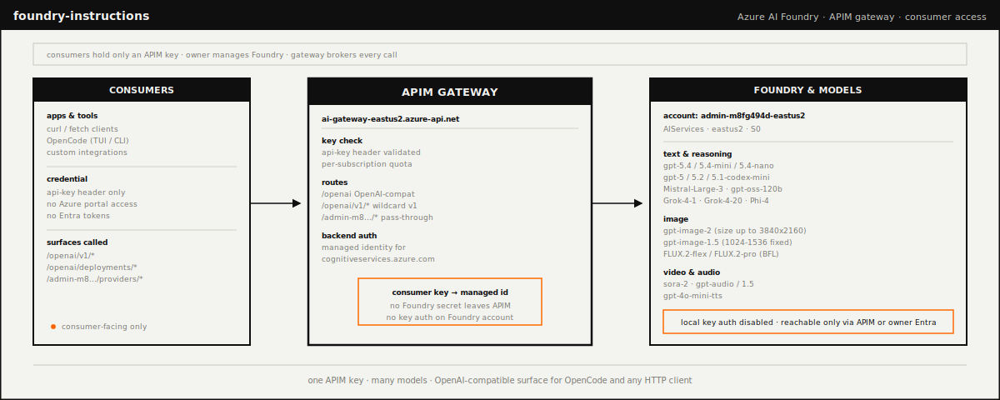
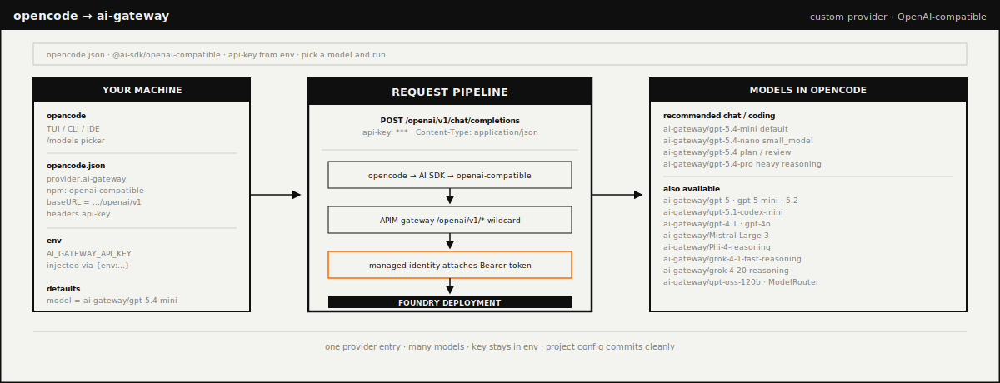

# AI Gateway Starter Kit (for the hack)

Welcome, hacker. You came here for one thing: an API key and a list of cool models you can call without setting up Azure, Entra, Foundry, or whatever the cloud team is renaming this week.

**Good news:** all of that is already done. You get one key. The key opens many doors. Several of those doors are GPT-5.4. One of them is Sora. One of them generates 4K images. None of them require you to argue with an OAuth screen at 2 a.m.

This repo is your map. Pick a guide below and start shipping.

---

## Pick Your Adventure

| You are... | Open this |
|---|---|
| A human with a curl habit | [`AI_GATEWAY_CONSUMER_GUIDE.md`](AI_GATEWAY_CONSUMER_GUIDE.md) |
| Using OpenCode and want `gpt-5.4` in your TUI | [`OPENCODE_INTEGRATION.md`](OPENCODE_INTEGRATION.md) |
| Using GitHub Copilot and want gateway models in VS Code | [`GITHUB_COPILOT_INTEGRATION.md`](GITHUB_COPILOT_INTEGRATION.md) |
| Generating images and want to know what sizes work | [`IMAGE_MODEL_USAGE.md`](IMAGE_MODEL_USAGE.md) |
| The person who set this up (you know who you are) | [`AZURE_AI_FOUNDRY_ACCESS.md`](AZURE_AI_FOUNDRY_ACCESS.md) |
| A skeptic who wants to see proof every model works | [`tests/model-support-summary.md`](tests/model-support-summary.md) |

If you read nothing else, read the **consumer guide**. It has copy-paste commands.

---

## What This Is

One Azure API Management gateway sitting in front of an Azure AI Foundry account. You send an `api-key` header. The gateway figures out the rest.

```text
you  ──api-key──►  gateway  ──magic──►  many models  ──►  vibes
```

For the slightly less hand-wavy version, see the diagram above (or [`docs/architecture-overview.svg`](docs/architecture-overview.svg) if your README viewer is being weird).

**Why this is nice for a hackathon:**

- **One key.** No "wait, which provider was that one on?" energy.
- **OpenAI-compatible.** If your code can talk to OpenAI, it can talk to this. Just change the base URL.
- **Many models, one bill.** GPT, Mistral, Grok, FLUX, Sora, audio. All through the same door.
- **No Azure portal tour required.** We did the boring part. You do the cool part.

---

## The Models

| Class | What you can call |
|---|---|
| Text + reasoning (use these for code) | `gpt-5.4`, `gpt-5.4-mini`, `gpt-5.4-nano`, `gpt-5.4-pro`, `gpt-5`, `gpt-5-mini`, `gpt-5.2`, `gpt-5.1-codex-mini`, `gpt-4.1`, `gpt-4o`, `gpt-oss-120b` |
| Other chat brains | `Mistral-Large-3`, `grok-4-1-fast-reasoning`, `grok-4-20-reasoning`, `Phi-4-reasoning` |
| Auto-pick a model | `ModelRouter` |
| Make pretty pictures | `gpt-image-2`, `gpt-image-1.5`, `FLUX.2-flex`, `FLUX.2-pro` |
| Make moving pictures | `sora-2` |
| Make sounds and words | `gpt-audio`, `gpt-audio-1.5`, `gpt-4o-mini-tts` |

If you can't decide, start with **`gpt-5.4-mini`**. It's the "good enough at almost everything, fast enough that you keep iterating" pick.

> **Heads up:** `grok-4-fast-reasoning` is deprecated. Pretend it isn't on the list. Use `grok-4-1-fast-reasoning` or `grok-4-20-reasoning` instead.

---

## 60-Second Quickstart (curl)

```bash
# 1. Save the key. (Don't paste it into a chat. Don't push it to git. You know.)
export AI_GATEWAY_API_KEY="<the-key-you-were-given>"

# 2. Say hi.
curl -X POST "https://ai-gateway-eastus2.azure-api.net/openai/v1/responses" \
  -H "api-key: $AI_GATEWAY_API_KEY" \
  -H "Content-Type: application/json" \
  -d '{"model":"gpt-5.4-nano","input":"Say hi to the hackathon."}'
```

If you get JSON back, you're in. If you get `401`, your key is wrong or unset. If you get `429`, slow down speedy, the model has a per-minute limit.

For every other model class (chat completions, image generation, video, audio), the consumer guide has a copy-paste block you can steal.

---

## 60-Second Quickstart (OpenCode)



OpenCode + this gateway = your terminal can now use `gpt-5.4` like it owns the place.

Drop this into `~/.config/opencode/opencode.json`:

```json
{
  "$schema": "https://opencode.ai/config.json",
  "provider": {
    "ai-gateway": {
      "npm": "@ai-sdk/openai",
      "name": "AI Gateway",
      "options": {
        "baseURL": "https://ai-gateway-eastus2.azure-api.net/openai/v1",
        "apiKey": "{env:AI_GATEWAY_API_KEY}",
        "headers": { "api-key": "{env:AI_GATEWAY_API_KEY}" }
      },
      "models": {
        "gpt-5.4":        { "name": "GPT-5.4" },
        "gpt-5.4-mini":   { "name": "GPT-5.4 Mini" },
        "gpt-5.4-nano":   { "name": "GPT-5.4 Nano" },
        "gpt-5":          { "name": "GPT-5" },
        "Mistral-Large-3": { "name": "Mistral Large 3" }
      }
    }
  },
  "model": "ai-gateway/gpt-5.4-mini",
  "small_model": "ai-gateway/gpt-5.4-nano"
}
```

Then:

```bash
export AI_GATEWAY_API_KEY="<the-key-you-were-given>"
opencode run --model ai-gateway/gpt-5.4-mini "Reply with OK and a small joke."
```

The full OpenCode setup (more models, reasoning variants, plan/build agents, image commands, error decoder) lives in [`OPENCODE_INTEGRATION.md`](OPENCODE_INTEGRATION.md).

---

## Doc Map

| File | What's inside |
|---|---|
| [`AI_GATEWAY_CONSUMER_GUIDE.md`](AI_GATEWAY_CONSUMER_GUIDE.md) | The "I just want to call stuff" guide. Curl examples for every model class. |
| [`OPENCODE_INTEGRATION.md`](OPENCODE_INTEGRATION.md) | Drop the gateway into OpenCode. Variants, agents, project configs, common errors. |
| [`GITHUB_COPILOT_INTEGRATION.md`](GITHUB_COPILOT_INTEGRATION.md) | Use the gateway as a BYOK provider inside GitHub Copilot Chat (VS Code, JetBrains, etc.). |
| [`IMAGE_MODEL_USAGE.md`](IMAGE_MODEL_USAGE.md) | Pixel-pushing reference. Sizes, formats, the difference between `size` and `width`/`height`. |
| [`AZURE_AI_FOUNDRY_ACCESS.md`](AZURE_AI_FOUNDRY_ACCESS.md) | Owner-side overview. Probably not interesting unless you're me. |
| [`tests/model-support-summary.md`](tests/model-support-summary.md) | Per-model evidence: what works, what's grumpy, what's wonderful. |

---

## Things You'll Want To Know

- **Auth header.** Always `api-key: <your-key>`. Not `Ocp-Apim-Subscription-Key`. Not `Authorization`. Just `api-key`. The gateway is opinionated.
- **Two surfaces.** Most stuff is at `/openai/...`. The FLUX image models live at `/admin-m8fg494d-eastus2/providers/blackforestlabs/...` because Black Forest Labs has its own API shape and we respect that.
- **Image sizes.** `gpt-image-2` uses `size: "WIDTHxHEIGHT"`. FLUX uses separate `width` and `height` integers. They are not interchangeable. The image guide has the full table of what works.
- **Rate limits are real.** Image and video deployments get a few requests per minute. Plan accordingly. Don't write a `for i in {1..1000}` loop unless you enjoy `429`s.
- **Don't share the key.** It's the only thing standing between you and a sad spreadsheet of usage charges. Treat it like the password to your old Hotmail account.

---

## Verified Working

These are all real outputs generated through the gateway and saved under `tests/generated-assets/`. They exist. Open them.

| File | Model | Notes |
|---|---|---|
| `images/gpt-image-2-large-realistic-observatory.png` | `gpt-image-2` | 4K (`3840x2160`), realism prompt, looks great |
| `images/FLUX.2-flex-large-realistic-observatory.png` | `FLUX.2-flex` | `2304x1728` PNG, also looks great |
| `images/FLUX.2-pro-large-realistic-observatory.png` | `FLUX.2-pro` | `2304x1728` PNG, looks even greater |
| `images/gpt-image-1.5-blue-dot.png` | `gpt-image-1.5` | A blue dot. Don't laugh, it proves the route works. |
| `videos/sora-2_video_*.mp4` | `sora-2` | Actual video. Through the gateway. With your key. |

Each image has a sidecar `.manifest.json` with the prompt and request metadata, in case you want to remix.

---

## Status Board

| Thing | State |
|---|---|
| Chat & responses through the gateway | ✅ working |
| OpenAI v1 wildcard routes | ✅ working |
| `gpt-image-2` and `gpt-image-1.5` | ✅ working |
| `FLUX.2-flex` and `FLUX.2-pro` | ✅ working (via the BFL route) |
| `sora-2` video creation + download | ✅ working |
| `Cohere-rerank-v4.0-fast` | 🚧 not exposed yet, ask the owner if you need it |
| `grok-4-fast-reasoning` | ⛔ deprecated; use `grok-4-1-fast-reasoning` |

---

## House Rules

1. **One key, one human.** Don't share keys with your team. Ask the owner for more keys. They are free to make.
2. **Fail loudly.** If something returns a weird error, screenshot it and post in the hack channel. The error message usually says exactly what's wrong, and someone has probably already hit it.
3. **Have fun.** This is a hack. Build the weird thing.

Now go ship something cool.
